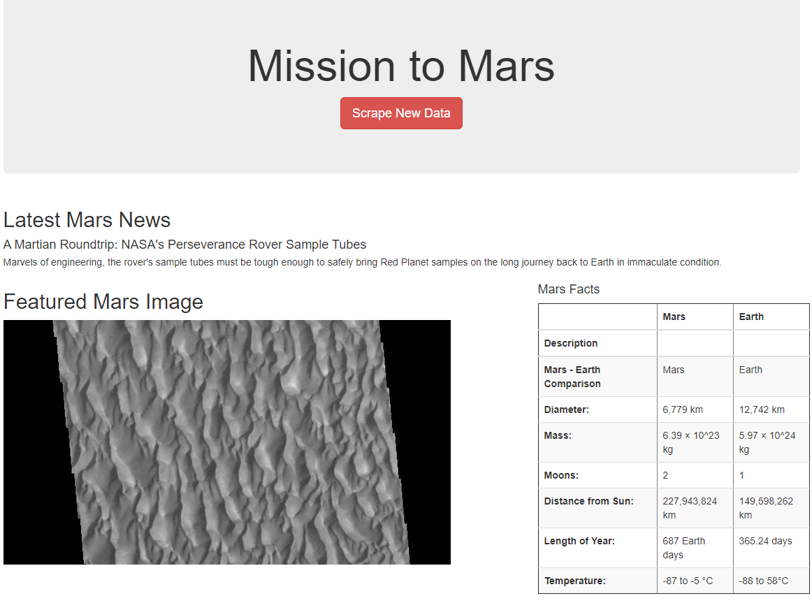

# Mission-to-Mars

## Collecting Information on the Red Planet
Create a web app showcasing a collection of information on the planet Mars by connecting multiple sources using python, splinter, beautiful soup, mongoDB, and flask. The webpage can be actively updated with a single click. 

### Creating the Project
Data was sourced from four webpages.
* https://redplanetscience.com

* https://spaceimages-mars.com

* https://galaxyfacts-mars.com

* https://marshemispheres.com

By using python, splinter, and beautiful soup each page could be scraped to refernce and collect data from each source. The data collected for this project includes news headlines, satellite images, scientific information presented in table format, and high resolution images of the planet mars. 

Data is collected and stored in a mongoDB database which is actively updated through a flask application. The mongo database is updated by clicking a button which activates a python script and feeds the new data through flask to a landing page. 

In the screenshot below Latest Mars News, Featured Mars Image, and Mars Facts are all collected from different resources and linked to the webpage through the mongo DB. 
